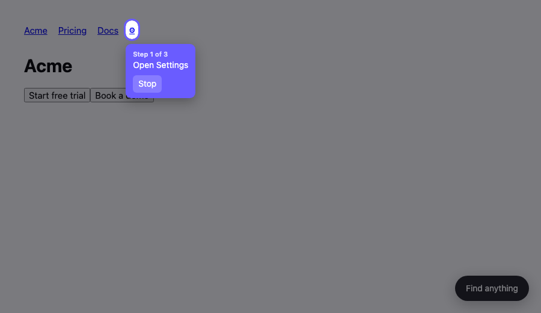

# Website Navigator

A `<script>` tag that lets visitors ask *"where is dark mode?"* and get the
buttons highlighted, in order, until they arrive.



## Why there is a crawler

A script in the browser can only see the page currently rendered — not your
routes, not your source, not a menu nobody has opened yet. So the site knowledge
is built **before** anyone asks: a Playwright crawl walks the site once, opens
menus, and records every interactive element and where it lives.

At query time that index plus the visitor's current screen goes to the model in
**one call**, which returns the whole path. The widget then runs the walkthrough
entirely on its own — no further network calls.

## Setup

```bash
npm install
npx playwright install chromium

# key from https://aistudio.google.com/apikey -- .env is gitignored, scripts load it
echo "LLM_API_KEY=AQ..." > .env
export NAV_ADMIN_KEY=$(openssl rand -hex 16)
```

The default model is **Gemini 3.5 Flash-Lite on the free tier** — $0, no card. The
site index is the bulk of every prompt, so the thing that matters most here is
context size, and Gemini's is large enough that no site outgrows it. Flash-Lite
also has the highest requests-per-minute of the free Google models.

Note that Google's free tier uses submitted data to improve their products. If
you're sending page digests of *customers'* sites, run a local model instead (see
below) — that's the reason the provider is configurable.

### Using a different provider

Any OpenAI-compatible endpoint works; it's env vars, not code:

```bash
# Groq — faster and smarter, but free-tier token/minute caps bite on large indexes
LLM_BASE_URL=https://api.groq.com/openai/v1  LLM_MODEL=llama-3.3-70b-versatile

# Ollama — nothing leaves the machine, no rate limits, no key
LLM_BASE_URL=http://localhost:11434/v1       LLM_MODEL=qwen3:14b

# OpenRouter — has a rotating set of :free models
LLM_BASE_URL=https://openrouter.ai/api/v1    LLM_MODEL=...:free
```

Whatever you point it at needs to honour `response_format: json_schema`. Ollama
does this with grammar-constrained decoding, which makes even a small local model
safe to use here.

Index the site (re-run after deploys that move navigation):

```bash
node crawl.ts acme https://acme.com
```

For anything behind a login, hand the crawler a Playwright auth state — without
it, every settings page is invisible:

```bash
node crawl.ts acme https://acme.com --auth ./auth.json
```

Run the server, then drop the tag into the site:

```bash
node server.ts
```

```html
<script src="https://your-server/nav.js" data-site="acme"></script>
```

## Cost and limits

One model call per *distinct* question per site. Answers are cached by question,
so the thousandth visitor asking about dark mode costs nothing, and the cache is
what keeps a free tier's rate limits comfortable. Cache is cleared whenever the
site is re-crawled.

Neither Google nor Groq publishes exact free-tier numbers in their docs any more —
both now defer to your account dashboard, so check there rather than trusting the
figures that circulate online.

On sites with more than 600 indexed elements the index is trimmed before the
prompt, keeping every menu opener and everything on the visitor's current page
(trimming by query words alone would drop the intermediate steps and break the
path).

## Tests

```bash
npm test
```

Spins up a demo site, crawls it, and drives the real widget in a real browser
through all three steps. Without credentials it stubs the model's answer so the
crawler and widget are still covered end to end.

## Limits

- **Crawl depth is one menu level.** A target nested two menus deep on the same
  page won't be indexed; it needs a recursive pass in `crawl.ts`.
- **Clicking is deliberately conservative.** The crawler only opens elements that
  declare themselves disclosures (`aria-haspopup`, `aria-expanded`, `<summary>`)
  or are labelled with a nav word. It will not click arbitrary buttons on your
  site, so a menu that looks like neither won't be opened.
- **The index goes stale.** When a step's label no longer resolves, the widget
  makes one recovery call with the live page and retries. Re-crawl on deploy.
- **Destructive actions are fenced off.** The model is instructed never to route
  someone to a delete/deactivate/reset control unless they asked for that exact
  action — without it, "cancel my subscription" confidently pointed at "Delete
  account". Re-check this if you change the system prompt.
- **A model can invent labels.** A JSON schema guarantees the shape of the reply,
  not its truth. The server drops any step naming something absent from both the
  index and the live page, and lowers confidence when it does — this is what makes
  a smaller free model safe to use. Watch the `dropped N invented step(s)` warnings
  in the server log; frequent ones mean the model is too weak or the index is stale.
- **Label matching is case-insensitive substring**, so non-English sites and
  icon-only controls without `aria-label` will match poorly.
